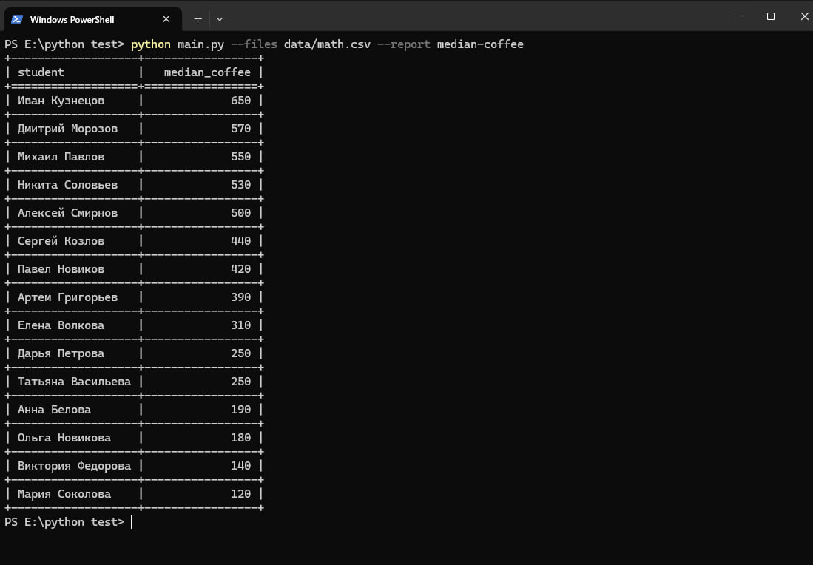

# Coffee Report

CLI-инструмент для формирования отчётов по данным студенческих сессий из CSV-файлов.

## Установка зависимостей

```bash
pip install tabulate
# для разработки и тестов
pip install pytest pytest-cov
```

## Запуск

```bash
# Один файл
python main.py --files data/math.csv --report median-coffee

# Несколько файлов
python main.py --files data/math.csv data/physics.csv --report median-coffee
```

Пример вывода:

```

## Тесты

```bash
pytest
pytest --cov --cov-report=term-missing
```

## Добавление нового отчёта

1. Создайте класс с методом `generate(self, rows: list[dict]) -> str` в `reports.py`.
2. Зарегистрируйте его в словаре `REPORTS` под нужным именем.

```python
class TotalCoffeeReport:
    def generate(self, rows: list[dict]) -> str:
        ...

REPORTS = {
    "median-coffee": MedianCoffeeReport(),
    "total-coffee": TotalCoffeeReport(),
}
```
